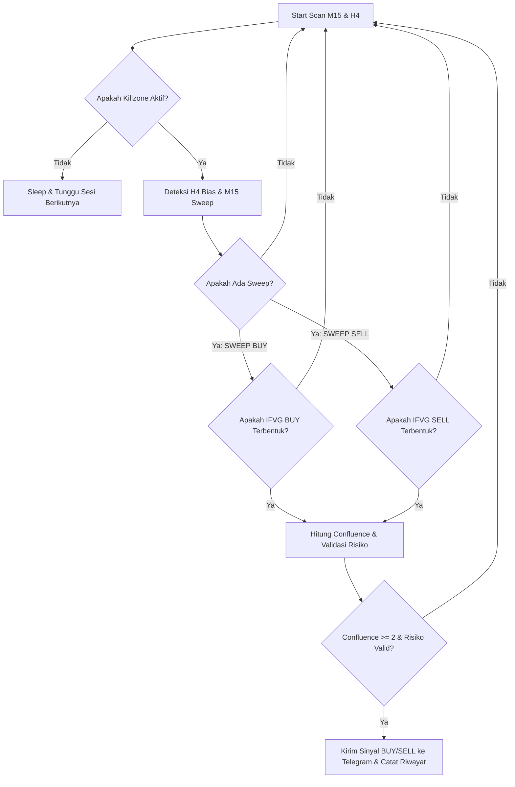

# 🎯 XAUUSD ICT Trading Signal Bot (v2.0 - Aggressive & Aligned)

Bot trading otomatis berbasis Python yang diintegrasikan langsung dengan **MetaTrader 5 (MT5)** dan **Telegram** untuk melakukan pemindaian (scanning) sinyal trading presisi tinggi pada pasangan mata uang **XAUUSD (Gold)** menggunakan konsep **ICT (Inner Circle Trader)**.

---

## 🚀 Fitur Utama

1. **Analisis Tren HTF (High Timeframe H4 Bias):**
   * Menggunakan **Dual Moving Average** (MA Fast & MA Slow) pada Timeframe H4.
   * Menyaring arah perdagangan agar selalu selaras dengan tren pasar yang dominan (`BULLISH`, `BEARISH`, atau `RANGING`).

2. **Deteksi Likuiditas (M15 Liquidity Sweep & Near-Sweep):**
   * Mencari pembersihan likuiditas (*liquidity sweep*) pada level puncak (*swing high*) dan dasar (*swing low*) dalam rentang waktu yang dinamis.
   * Dilengkapi fitur **Near-Sweep** dengan toleransi threshold ($1.0) dan validasi harga penutupan (*close price rejection*) untuk menghindari sinyal *breakout* palsu.

3. **Konfirmasi Struktur (Inversed Fair Value Gap - IFVG):**
   * Menggunakan **Inversed FVG (IFVG)** pada timeframe M15 sebagai konfirmasi entri yang valid.
   * Pemindaian dilakukan secara mundur (*backwards-scanning*) untuk memprioritaskan FVG terbaru dan tersegar (*fresh IFVG*).

4. **Filter Waktu Sesi (Killzone Session):**
   * Hanya melakukan pemindaian dan eksekusi pada jam-jam pasar aktif berlikuiditas tinggi: **Sesi Asia**, **Sesi London**, dan **Sesi New York (WIB)**.

5. **Manajemen Risiko Cerdas (Smart Risk Manager):**
   * Otomatis menghitung rasio **Risk to Reward (R:R)** yang ideal.
   * Menentukan level **Stop Loss (SL)** dengan buffer pengaman, serta **Take Profit 1 (2R)** dan **Take Profit 2 (4R)**.
   * Validasi risiko batas minimum ($1.50) dan maksimum ($15.00) untuk mencegah *noise* pasar atau jarak entri yang terlalu jauh.
   * Koreksi SL otomatis (*self-correcting SL*) jika harga sudah bergerak melampaui titik ekstrem.

6. **Telegram Bot Interaktif:**
   * Pengiriman sinyal instan lengkap dengan grafik detail harga entri, SL, TP1, TP2, nilai risiko, bias tren, dan skor konfluensi.
   * Fitur interaktif untuk memantau status bot, melihat data live, menjeda bot (`/pause`), atau melanjutkannya kembali (`/resume`).

---

## 📐 Arsitektur Sistem & Logika Sinyal

Bot menggunakan **Skor Konfluensi (Maksimal 4/4)** berbasis arah yang ter-align sempurna sebelum mengirimkan sinyal:



---

## 🛠️ Panduan Instalasi & Setup

### 1. Prasyarat Sistem
* **Sistem Operasi:** Windows (Wajib untuk MetaTrader 5 API).
* **Python:** Versi 3.8 hingga 3.11.
* **Aplikasi:** Terminal MetaTrader 5 terinstal dan login ke akun trading Anda.

### 2. Kloning Repositori
```bash
git clone https://github.com/sakeeeeeeee/xauusd-ict-bot.git
cd xauusd-ict-bot
```

### 3. Instal Dependensi
```bash
pip install -r requirements.txt
```

### 4. Konfigurasi Lingkungan (`.env`)
Buat file bernama `.env` di direktori utama proyek Anda dan masukkan token API Telegram Anda:
```env
TELEGRAM_TOKEN=1234567890:ABCdefGhIJKlmNoPQRsTUVwxyZ
TELEGRAM_CHAT_ID=-987654321
```

### 5. Pengaturan Parameter (`src/config.py`)
Anda dapat menyesuaikan parameter strategi pada file `src/config.py`:
* `SWEEP_LOOKBACK = 15`: Rentang lilin (candles) untuk mencari swing high/low.
* `NEAR_SWEEP_THRESHOLD = 1.0`: Nilai toleransi jarak wick dalam USD.
* `MIN_CONFLUENCE_SCORE = 2`: Batas minimal konfluensi untuk mengirim sinyal.
* `MIN_RISK` & `MAX_RISK`: Batasan nilai SL dalam USD.

---

## 🚀 Cara Menjalankan Bot

### 1. Jalankan Bot Utama (Scanning Real-Time)
Pastikan aplikasi MetaTrader 5 Anda sudah terbuka, lalu jalankan perintah:
```bash
python run.py
```

### 2. Jalankan Diagnosa Menyeluruh (CLI)
Anda bisa mengecek koneksi MT5, arah/bias harga, dan detail filter sinyal melalui script diagnostik tunggal:

```bash
# Diagnosa Koneksi MetaTrader 5
python -m scripts.diagnose --mt5

# Diagnosa Support/Resistance & Jarak Harga
python -m scripts.diagnose --arah

# Diagnosa Keseluruhan Filter Sinyal
python -m scripts.diagnose --signal

# Kombinasi
python -m scripts.diagnose --mt5 --signal --arah
```

---

## 📂 Struktur Folder Proyek

```text
xauusd-ict-bot/
├── run.py                          # Entry point utama (python run.py)
├── requirements.txt                # Daftar pustaka Python yang dibutuhkan
├── .env                            # Kredensial Telegram (tidak di-commit)
├── .gitignore                      # File pengabaian Git
│
├── src/                            # Source code utama
│   ├── __init__.py
│   ├── main.py                     # Engine utama & loop scanning sinyal
│   ├── config.py                   # Konfigurasi parameter trading & risiko
│   ├── analysis/                   # Modul analisis teknikal
│   │   ├── __init__.py
│   │   └── analysis.py             # Deteksi Bias H4, Sweep M15, IFVG M15
│   ├── risk/                       # Modul manajemen risiko
│   │   ├── __init__.py
│   │   └── risk_manager.py         # Penghitung SL/TP, validasi, & trade log
│   ├── telegram/                   # Modul integrasi Telegram
│   │   ├── __init__.py
│   │   └── telegram_bot.py         # Bot Telegram interaktif (polling)
│   └── mt5/                        # Placeholder untuk abstraksi MT5
│       └── __init__.py
│
├── scripts/                        # Script utilitas & debugging
│   └── diagnose.py                 # CLI tunggal untuk diagnostik bot (--mt5, --signal, --arah)
│
└── tests/                          # Unit tests
    ├── __init__.py
    ├── test_analysis.py            # Test logic engine
    └── test_risk.py                # Test risk management
```

---

## ⚖️ Penafian (Disclaimer)
*Perangkat lunak ini dibuat untuk tujuan edukasi dan penyediaan informasi sinyal. Penggunaan bot dalam perdagangan riil sepenuhnya merupakan tanggung jawab pengguna. Selalu lakukan backtest dan pengujian pada akun Demo sebelum menggunakan dana riil.*

---
*Dikembangkan dengan penuh dedikasi untuk keunggulan teknikal perdagangan otomatis.* 🚀
