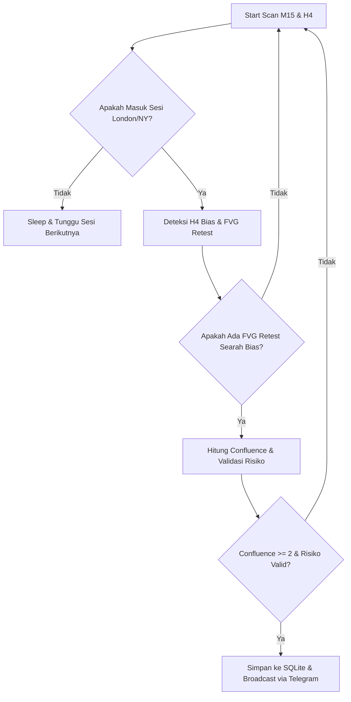

# 🎯 XAUUSD ICT Trading Signal Bot (v3.0 - Pure Silver Bullet FVG)

Bot trading otomatis berbasis Python yang diintegrasikan langsung dengan **MetaTrader 5 (MT5)** dan **Telegram** untuk melakukan pemindaian (scanning) sinyal trading presisi tinggi pada pasangan mata uang **XAUUSD (Gold)** menggunakan konsep **ICT (Inner Circle Trader) Silver Bullet**.

---

## 🚀 Fitur Utama

1. **Analisis Tren HTF (High Timeframe H4 Bias):**
   * Menggunakan **Dual Moving Average** (MA Fast & MA Slow) pada Timeframe H4.
   * Menyaring arah perdagangan agar selalu selaras dengan tren pasar yang dominan (`BULLISH`, `BEARISH`, atau `RANGING`).

2. **Deteksi FVG Retest (Silver Bullet Momentum):**
   * Berfokus murni pada pergerakan momentum yang menciptakan **Fair Value Gap (FVG)**.
   * Menunggu harga kembali untuk me-retest FVG tersebut sebelum memberikan sinyal, mengikuti algoritma ICT Silver Bullet klasik.

3. **Filter Waktu Sesi (Killzone Session):**
   * Hanya melakukan pemindaian dan eksekusi pada jam-jam pasar berlikuiditas tinggi: **Sesi London** (dan **New York** jika diaktifkan).
   * Mencegah perdagangan pada sesi Asia yang rentan terhadap *whipsaw*.

4. **Manajemen Risiko Cerdas (Smart Risk Manager):**
   * Otomatis menghitung rasio **Risk to Reward (R:R)** yang ideal.
   * Menentukan level **Stop Loss (SL)** dinamis berdasarkan ATR dan struktur harga (*Swing High/Low*).
   * Validasi risiko batas minimum dan maksimum untuk mencegah kerugian konyol saat volatilitas menggila.

5. **Telegram Bot Interaktif & Dashboard:**
   * Pengiriman sinyal instan lengkap dengan grafik detail harga entri, SL, TP1, TP2, nilai risiko, bias tren, dan skor konfluensi.
   * Fitur interaktif via perintah Telegram (`/status`, `/config`, `/stats`).
   * **Dashboard Streamlit** mandiri terpisah untuk melihat analitik dan *win rate* riwayat trade secara visual.

---

## 📐 Arsitektur Sistem (Dual Tier Architecture)

Bot ini menggunakan **Arsitektur Dual-Tier (Dua Lapisan)** untuk memisahkan proses logika dari UI:
1. **Tier 1: Core Engine (`main.py`)** berjalan di *main thread*. Tugasnya murni melakukan *heavy-lifting*: koneksi ke MT5, menarik data *tick/candle*, menjalankan algoritma deteksi FVG, dan menyimpan *trade* ke SQLite (`bot_database.db`).
2. **Tier 2: Telegram Interface (`telegram_bot.py`)** berjalan secara asinkron di *background thread*. Membalas *user* tanpa menghalangi (blocking) proses *scan* di Tier 1.



---

## 🧠 Utilitas LLM Offline (Gemini Analysis)

Algoritma eksekusi *live* berjalan murni 100% menggunakan kode mekanikal (*rule-based*) untuk kecepatan dan akurasi (0 *latency*). 

Namun, bot ini menyediakan skrip khusus **Gemini AI** (`scripts/analyze_with_gemini.py`) yang bisa dieksekusi secara manual/luring seminggu sekali untuk menganalisis performa *bot* dari database dan memberikan saran teknikal. Agen LLM dilarang keras untuk berpartisipasi dalam siklus *live scanning*.

---

## 🛠️ Panduan Instalasi & Setup

### 1. Prasyarat Sistem
* **Sistem Operasi:** Windows (Wajib untuk MetaTrader 5 API).
* **Python:** Versi 3.8 hingga 3.11.
* **Aplikasi:** Terminal MetaTrader 5 terinstal dan login ke akun trading Anda.

### 2. Kloning Repositori
```bash
git clone https://github.com/sakeeeeeeee/xauusd-ict-bot.git
cd xauusd-ict-bot
```

### 3. Instal Dependensi
```bash
python -m venv .venv
.venv\Scripts\activate
pip install -r requirements.txt
```

### 4. Konfigurasi Lingkungan Variabel (`.env`)
Buat file bernama `.env` di direktori utama proyek Anda dan lengkapi variabel berikut (Wajib!):
```env
# --- TELEGRAM SETTINGS ---
TELEGRAM_TOKEN=1234567890:ABCdefGhIJKlmNoPQRsTUVwxyZ
TELEGRAM_CHAT_ID=-987654321

# --- GEMINI SETTINGS (OPSIONAL, untuk analyze_with_gemini.py) ---
GEMINI_API_KEY=AIzaSyA...
```

### 5. Pengaturan Parameter (`src/config.py`)
Sesuaikan perilaku bot pada file `src/config.py`. Beberapa yang penting:
* `SYMBOLS`: Mata uang yang di-scan (contoh: `["XAUUSD"]`).
* `CHART_ENABLED`: (`True`/`False`) Nyalakan untuk otomatis merender dan mengirim *chart* ke Telegram saat ada sinyal.
* `MIN_CONFLUENCE_SWING`: Batas skor minimal (default `2` dari maksimal 3).

---

## 🚀 Cara Menjalankan Bot & Util

### 1. Jalankan Bot Utama (VPS / Background)
Gunakan *script launcher* (yang mengaktifkan environment dan watchdog).
```bash
python scripts\watchdog.py
```

### 2. Menjalankan Dashboard Analitik (Streamlit)
```bash
streamlit run dashboard/app.py
```

### 3. Simulasi Strategi (Backtest Engine)
```bash
python -m scripts.run_backtest --symbol XAUUSD --days 30
```
*Hasil simulasi PnL, Win Rate, dan Profit Factor akan dicetak di layar console.*

---

## ⚖️ Penafian (Disclaimer & Peringatan Risiko)

**BACA DENGAN SEKSAMA SEBELUM MENGGUNAKAN PERANGKAT LUNAK INI:**

1. **Bukan Nasihat Keuangan (*Not Financial Advice*):** Perangkat lunak (bot) ini, beserta seluruh kode, skrip, dan dokumentasinya, disediakan semata-mata untuk tujuan **edukasi, penelitian, dan pembelajaran algoritma**. 
2. **Risiko Kerugian Ekstrem:** Perdagangan valuta asing (Forex) dan komoditas (terutama XAUUSD/Emas) melibatkan risiko kerugian finansial yang sangat tinggi. Pergerakan pasar dapat menyebabkan hilangnya seluruh modal (dana) Anda secara instan.
3. **Wajib Akun Demo (Mandatory Demo):** Pengguna **DIWAJIBKAN** untuk menggunakan bot ini hanya di akun **Demo/Simulasi** dengan dana virtual.
4. **Ketiadaan Jaminan:** Pengembang bot tidak memberikan jaminan keuntungan (*profit*) apa pun, baik tersurat maupun tersirat.

*Dengan mengunduh, menyalin, dan menjalankan *source code* proyek ini, Anda setuju membebaskan pengembang dari segala bentuk tuntutan atau kerugian finansial.*

---

*Dikembangkan dengan penuh dedikasi untuk keunggulan teknikal perdagangan otomatis.* 🚀
